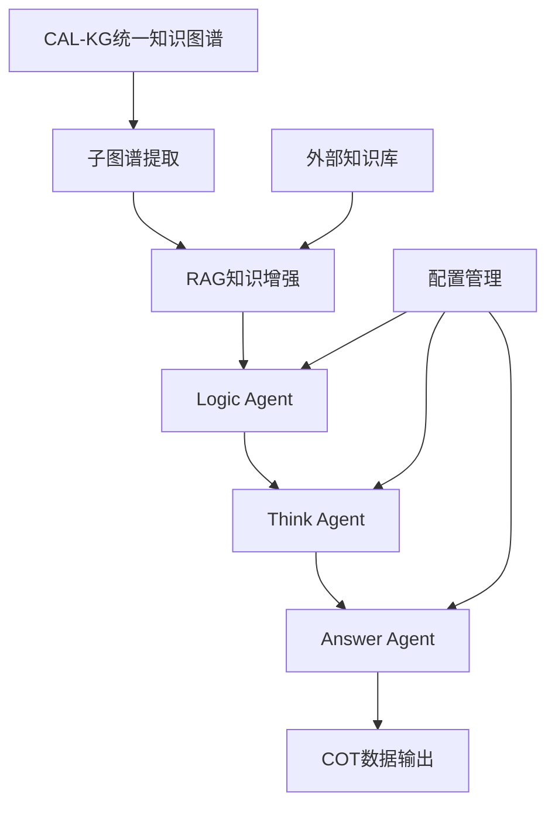

# CT-MA-CircuitThinking: 电路领域思维链生成系统

<div align="center">

# 🧠 CT-MA-CircuitThinking

**Circuit Thinking Multi-Agent System**

[](https://python.org)
[](https://crewai.com)
[](https://langchain.com)

*基于知识图谱与多Agent的电路领域思维链生成系统*

</div>

---

## 🎯 项目概述

CT-MA-CircuitThinking是一个创新的多Agent协作系统，专门设计用于将CAL-KG系统产生的结构化电路知识图谱转化为高质量的思维链（Chain-of-Thought, CoT）数据。

### 🌟 核心价值

- **🔗 知识图谱驱动**: 基于CAL-KG系统的统一知识图谱进行思维链生成
- **🤖 多Agent协作**: Logic Agent、Think Agent、Answer Agent协同工作
- **🧠 深度推理**: 生成包含完整推理过程的三段式COT数据
- **📚 RAG增强**: 结合外部知识库提供丰富的技术细节

### 🎯 应用场景

- 📖 **LLM训练数据**: 为大语言模型提供高质量的电路领域推理数据
- 🎓 **教育辅助**: 生成电路设计教学的思维过程示例
- 🔬 **技术分析**: 辅助工程师理解复杂电路设计逻辑
- 💡 **知识传承**: 将专家经验转化为结构化的推理数据

---

## ✨ 核心特性

### 🔍 知识图谱处理
- **子图谱提取**: 从统一知识图谱中提取以电路应用为终点的路径
- **路径分析**: 分析从基础概念到核心技术到应用的完整逻辑链
- **依赖追踪**: 跟踪知识点之间的依赖关系

### 🤖 多Agent系统
- **Logic Agent**: 提取知识图谱思维链脉络
- **Think Agent**: 基于逻辑脉络进行详细推理
- **Answer Agent**: 生成最终的综合性回答
- **Coordinator**: 协调Agent协作和质量控制

### 📚 RAG增强
- **向量检索**: 基于ChromaDB的语义检索
- **知识补充**: 为图谱节点补充详细技术信息
- **证据提取**: 提供公式、定义、设计原则等技术证据

### 📊 COT数据生成
- **三段式结构**: `<logic>` + `<think>` + `<answer>`
- **格式验证**: 确保输出符合指定格式
- **质量控制**: 多层次的内容质量检查

---

## 🏗️ 系统架构

### 📁 项目结构

```
CT-MA-CircuitThinking/
├── README.md                    # 项目说明文档
├── requirements.txt             # 依赖包列表
├── main.py                      # 主程序入口
├── config/                      # 配置文件目录
│   ├── system_config.yaml      # 系统配置
│   ├── agent_prompts.yaml      # Agent提示词配置
│   └── rag_config.yaml         # RAG配置
├── src/                         # 源代码目录
│   ├── core/                   # 知识图谱处理核心
│   │   ├── __init__.py
│   │   ├── kg_loader.py        # 知识图谱加载器
│   │   ├── subgraph_extractor.py # 子图谱提取器
│   │   └── path_analyzer.py    # 路径分析器
│   ├── rag/                    # RAG增强层
│   │   ├── __init__.py
│   │   ├── vector_store.py     # 向量存储
│   │   ├── retriever.py        # 检索器
│   │   └── knowledge_enhancer.py # 知识增强器
│   ├── agents/                 # 多Agent系统
│   │   ├── __init__.py
│   │   ├── logic_agent.py      # 逻辑分析Agent
│   │   ├── think_agent.py      # 思维推理Agent
│   │   ├── answer_agent.py     # 答案生成Agent
│   │   └── coordinator.py      # 协调器
│   ├── cot/                    # COT数据生成
│   │   ├── __init__.py
│   │   ├── data_generator.py   # COT数据生成器
│   │   ├── format_validator.py # 格式验证器
│   │   └── quality_checker.py  # 质量检查器
│   └── utils/                  # 工具函数
│       ├── __init__.py
│       ├── config_manager.py   # 配置管理
│       ├── logger.py          # 日志管理
│       └── metrics.py         # 指标收集
├── data/                       # 数据目录
│   ├── input/                  # 输入数据
│   │   └── unified_knowledge_graph.json # 从CAL-KG导入
│   ├── knowledge_base/         # 原始电路文档
│   └── output/                 # 输出数据
│       ├── subgraphs/         # 提取的子图谱
│       ├── cot_datasets/      # 生成的COT数据
│       └── reports/           # 分析报告
├── tests/                      # 测试目录
├── scripts/                    # 脚本目录
│   ├── setup_environment.py   # 环境设置
│   ├── import_kg.py           # 知识图谱导入
│   └── batch_generate.py      # 批量生成
└── notebooks/                  # Jupyter笔记本
    ├── analysis.ipynb         # 数据分析
    └── visualization.ipynb    # 可视化
```

### 🔄 工作流程



---

## 🔧 技术栈

### 核心技术
- **Python**: 3.9+
- **多Agent框架**: CrewAI + LangGraph
- **RAG框架**: LangChain + ChromaDB
- **图处理**: NetworkX
- **LLM**: DeepSeek-V3 / GPT-4
- **嵌入模型**: text-embedding-3-small

### 支持技术
- **配置管理**: Hydra + OmegaConf
- **任务调度**: Celery + Redis
- **监控**: Weights & Biases
- **部署**: Docker + FastAPI

---

## 📦 安装配置

### 🔧 环境要求

- **Python**: 3.9+
- **内存**: 建议16GB+
- **存储**: 建议5GB+可用空间
- **网络**: 稳定的API访问网络

### 📥 安装步骤

```bash
# 1. 进入项目目录
cd CAL_KG_System/CT-MA-CircuitThinking

# 2. 创建虚拟环境
conda create -n ct-ma python=3.9
conda activate ct-ma

# 3. 安装依赖
pip install -r requirements.txt

# 4. 配置API密钥
cp config/system_config.yaml.example config/system_config.yaml
# 编辑配置文件，填入API密钥

# 5. 导入知识图谱
python scripts/import_kg.py

# 6. 设置知识库
python scripts/setup_environment.py
```

---

## 🚀 快速开始

### 📝 准备数据

1. 确保CAL-KG系统已生成统一知识图谱
2. 将电路相关文档放入 `data/knowledge_base/` 目录

### ⚡ 运行系统

```bash
# 完整流水线运行
python main.py --mode full --batch_size 10

# 分步执行
python main.py --mode extract_subgraphs
python main.py --mode setup_rag
python main.py --mode generate_cot
```

### 📊 查看结果

- **COT数据集**: `data/output/cot_datasets/`
- **分析报告**: `data/output/reports/`
- **子图谱**: `data/output/subgraphs/`

---

## 📈 预期成果

### 数据成果
- 生成500-1000条高质量COT数据
- 覆盖主要电路应用领域
- 包含完整的logic-think-answer结构

### 技术成果
- 可复用的多Agent COT生成框架
- 知识图谱到思维链的转换方法
- RAG增强的Agent协作模式

### 应用价值
- 支持电路设计教育
- 辅助工程师技术决策
- 构建专业领域推理数据集

---

## 🤝 贡献指南

欢迎贡献代码、报告问题或提出改进建议！

---

## 📄 许可证

本项目采用MIT许可证。

---

<div align="center">

**🧠 CT-MA-CircuitThinking - 让电路思维链生成变得智能高效！**

*基于知识图谱与多Agent的下一代思维链生成系统*

</div>
