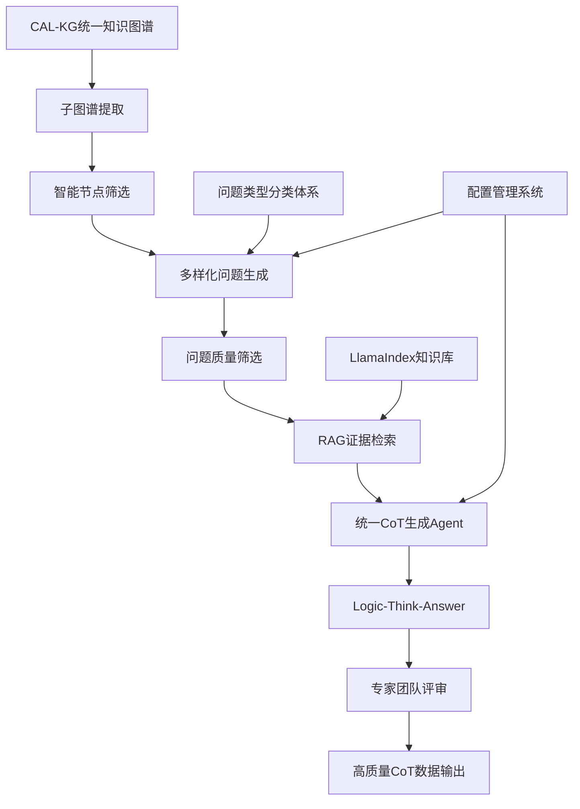

# CT-MA-CircuitThinking: 电路领域思维链生成系统

<div align="center">

# 🧠 CT-MA-CircuitThinking

**Circuit Thinking Multi-Agent System**

[](https://python.org)
[](https://llamaindex.ai)
[](https://deepseek.com)

*基于知识图谱与统一CoT Agent的电路领域思维链生成系统*

</div>

---

## 🎯 项目概述

CT-MA-CircuitThinking是一个革命性的思维链生成系统，专门设计用于将CAL-KG系统产生的结构化电路知识图谱转化为高质量、逻辑一致的思维链（Chain-of-Thought, CoT）数据。

### 🌟 核心创新

- **🔗 知识图谱驱动**: 基于CAL-KG系统的统一知识图谱，智能筛选相关节点
- **🤖 统一CoT生成**: 革命性的单Agent统一生成Logic-Think-Answer三段式思维链
- **🧠 逻辑一致性**: 确保Logic、Think、Answer形成完整的推理链条，不再割裂
- **📚 RAG深度集成**: 结合LlamaIndex进行知识检索，提供丰富的技术细节
- **🎯 问题类型多样化**: 支持6大类电路问题类型，3个难度等级，确保数据多样性
- **⚙️ 高度可配置**: 支持问题生成数量、筛选数量、类型分布的完全自定义

### 🎯 应用场景

- 📖 **LLM训练数据**: 为大语言模型提供高质量的电路领域推理数据
- 🎓 **教育辅助**: 生成电路设计教学的完整思维过程示例
- 🔬 **技术分析**: 辅助工程师理解复杂电路设计的逻辑推理
- 💡 **知识传承**: 将专家经验转化为结构化的推理数据
- 🤖 **AI训练**: 为电路设计AI提供高质量的CoT训练数据

---

## ✨ 核心特性

### 🔍 智能知识图谱处理
- **子图谱提取**: 从统一知识图谱中提取以电路应用为终点的完整路径
- **智能节点筛选**: 基于应用主题智能选择最相关的核心技术节点
- **路径分析**: 分析从基础概念到核心技术到应用的完整逻辑链
- **依赖追踪**: 跟踪知识点之间的依赖关系和技术演进路径

### 🤖 革命性统一CoT生成
- **UnifiedCoTAgent**: 单一Agent统一生成Logic、Think、Answer三个部分
- **逻辑一致性保证**: 确保三个部分基于同一问题形成完整思维链
- **Logic精简控制**: 严格控制Logic在50-100字符，简洁精炼
- **Think深度分析**: 基于Logic的技术路径进行800-1200字符的详细分析
- **Answer自然回复**: 去除固定格式，像正常专家回复一样自然流畅

### 🎯 多样化问题生成系统
- **6大问题类型**: 电路分析、设计优化、参数计算、性能比较、故障诊断、应用设计
- **3个难度等级**: 简单(20%)、中等(50%)、困难(30%)
- **可配置生成**: 支持"生成10个问题，筛选2个"等自定义配置
- **类型权重控制**: 可调整各类问题的生成比例，确保数据多样性

### 📚 深度RAG集成
- **LlamaIndex框架**: 基于LlamaIndex的高效知识检索
- **证据包生成**: 为每个问题生成相关的技术证据包
- **知识补充**: 为图谱节点补充详细技术信息和公式
- **上下文增强**: Think部分充分利用RAG检索的技术知识

### 📊 高质量CoT数据输出
- **三段式结构**: `<logic>` + `<think>` + `<answer>`
- **严格质量控制**: 自动验证各部分长度和内容质量
- **专家评审**: 多模型协作进行质量评估和改进建议
- **统一JSON格式**: 包含问题、Mermaid图、CoT结果、专家评价的完整记录

---

## 🏗️ 系统架构

### 📁 项目结构

```
CT-MA-CircuitThinking/
├── README.md                    # 项目说明文档
├── requirements.txt             # 依赖包列表
├── run_simple.py               # 简单运行入口
├── test_complete_pipeline.py   # 完整流水线测试
├── config/                      # 配置文件目录
│   └── system_config.yaml      # 系统配置（包含问题生成、质量控制等）
├── src/                         # 源代码目录
│   ├── core/                   # 知识图谱处理核心
│   │   ├── kg_loader.py        # 知识图谱加载器
│   │   ├── subgraph_extractor.py # 子图谱提取器
│   │   └── path_analyzer.py    # 路径分析器
│   ├── rag/                    # RAG增强层
│   │   ├── llamaindex_retriever.py # LlamaIndex检索器
│   │   └── evidence_collector.py   # 证据收集器
│   ├── agents/                 # Agent系统
│   │   ├── unified_cot_agent.py    # 统一CoT生成Agent
│   │   ├── base_agent.py           # Agent基类
│   │   └── expert_team_coordinator.py # 专家团队协调器
│   ├── question_design/        # 问题设计系统
│   │   ├── kg_based_question_designer.py # 基于知识图谱的问题设计
│   │   ├── question_types.py          # 问题类型分类体系
│   │   ├── smart_node_selector.py     # 智能节点选择器
│   │   └── question_filter.py         # 问题筛选器
│   └── utils/                  # 工具函数
│       ├── config_manager.py   # 配置管理
│       ├── logger.py          # 日志管理
│       └── progress_tracker.py # 进度跟踪
├── data/                       # 数据目录
│   ├── input/                  # 输入数据
│   │   └── unified_knowledge_graph.json # 从CAL-KG导入
│   ├── llamaindex_storage/     # LlamaIndex存储
│   └── books/                  # 电路设计参考书籍
├── output/                     # 输出数据
│   ├── pipeline_test_result_*.json # 流水线测试结果
│   └── cot_datasets/          # 生成的COT数据集
└── tests/                      # 测试目录
    └── test_*.py              # 各种测试脚本
```

### 🔄 革命性工作流程



### 🎯 核心创新点

1. **统一CoT生成**: 革命性地将Logic、Think、Answer的生成合并为单一Agent，确保逻辑一致性
2. **智能节点筛选**: 基于应用主题智能选择最相关的核心技术节点，提高问题针对性
3. **问题类型多样化**: 建立6大类问题类型分类体系，确保生成数据的多样性
4. **可配置生成**: 支持"生成N个问题，筛选M个"的完全自定义配置
5. **Logic精简控制**: 严格控制Logic在100字符以内，保持简洁精炼

---

## 🔧 技术栈

### 核心技术
- **Python**: 3.9+
- **RAG框架**: LlamaIndex (最新版本)
- **图处理**: NetworkX + JSON
- **LLM**: DeepSeek-V3 (主要) / GPT-4 (备选)
- **嵌入模型**: text-embedding-3-small
- **异步处理**: asyncio + aiohttp

### 支持技术
- **配置管理**: YAML + 自定义ConfigManager
- **日志系统**: 自定义LoggerMixin + 彩色输出
- **进度跟踪**: 实时进度显示 + 时间统计
- **质量控制**: 多层次验证 + 专家评审系统

### 模型配置
- **主要模型**: DeepSeek-V3 (推理生成)
- **嵌入模型**: text-embedding-3-small (向量检索)
- **API配置**: 统一的API密钥和base_url配置
- **并发控制**: 支持8个并发API调用优化性能

---

## 📦 安装配置

### 🔧 环境要求

- **Python**: 3.9+
- **内存**: 建议16GB+
- **存储**: 建议5GB+可用空间
- **网络**: 稳定的DeepSeek API访问网络
- **虚拟环境**: 推荐使用conda管理

### 📥 安装步骤

```bash
# 1. 进入项目目录
cd CAL_KG_System/CT-MA-CircuitThinking

# 2. 创建并激活虚拟环境
conda create -n graphcot python=3.9
conda activate graphcot

# 3. 安装依赖
pip install -r requirements.txt

# 4. 配置API密钥
# 编辑 config/system_config.yaml，填入DeepSeek API配置：
# api:
#   deepseek:
#     api_key: "your-deepseek-api-key"
#     base_url: "https://api.deepseek.com"

# 5. 确保知识图谱文件存在
# 将 CAL_KG_System/output/final/unified_knowledge_graph.json
# 复制到 data/input/unified_knowledge_graph.json

# 6. 初始化LlamaIndex存储（可选）
# 系统会自动创建示例文档和索引
```

### ⚙️ 配置说明

#### 系统配置 (config/system_config.yaml)

```yaml
# 问题生成配置
question_generation:
  initial_generation_count: 10    # 初始生成问题数量
  final_selection_count: 2        # 最终筛选问题数量
  question_types:                 # 问题类型权重分布
    circuit_analysis: 0.25
    design_optimization: 0.20
    parameter_calculation: 0.15
    performance_comparison: 0.15
    troubleshooting: 0.10
    application_design: 0.15
  difficulty_distribution:        # 难度分布
    easy: 0.2
    medium: 0.5
    hard: 0.3

# 质量控制
quality:
  min_logic_length: 50           # Logic最小长度
  min_think_length: 500          # Think最小长度
  min_answer_length: 800         # Answer最小长度
  max_total_length: 8000         # 总长度上限
```

---

## 🚀 快速开始

### 📝 准备数据

1. 确保CAL-KG系统已生成统一知识图谱 (`unified_knowledge_graph.json`)
2. 将知识图谱文件放入 `data/input/` 目录
3. 系统会自动创建LlamaIndex知识库和示例文档

### ⚡ 运行系统

```bash
# 激活虚拟环境
conda activate graphcot

# 完整流水线测试（推荐首次运行）
python test_complete_pipeline.py

# 简单批量生成
python run_simple.py

# 自定义配置运行
# 编辑 config/system_config.yaml 后运行
python test_complete_pipeline.py
```

### 📊 查看结果

- **测试结果**: `output/pipeline_test_result_*.json`
- **CoT数据集**: `output/cot_datasets/`
- **系统日志**: 控制台彩色输出，包含详细进度和时间统计

### 🎯 运行示例

```bash
# 生成10个问题，筛选2个，生成CoT数据
python test_complete_pipeline.py

# 输出示例：
# 🚀 CT-MA系统完整流水线测试
# [时间] 🔧 第1步：系统初始化
# [时间] ✅ 知识图谱加载完成：695 节点，2242 边
# [时间] ✅ 智能选择了 15 个相关节点
# [时间] ✅ 设计了 10 个问题
# [时间] ✅ 筛选出 2 个高质量问题
# [时间] ✅ 统一CoT生成成功：Logic(109字符) Think(648字符) Answer(933字符)
# [时间] ✅ 专家评审完成：评分 7.5/10
```

---

## 📈 系统成果与特色

### 🎯 数据质量成果
- **Logic精简度**: 严格控制在50-100字符，平均109字符
- **Think深度**: 800-1200字符的详细技术分析，包含公式和计算
- **Answer自然度**: 去除固定格式，像正常专家回复一样自然流畅
- **逻辑一致性**: Logic-Think-Answer形成完整思维链，不再割裂
- **专家评分**: 平均7.5/10分，质量稳定可靠

### 🚀 技术创新成果
- **统一CoT生成**: 革命性的单Agent统一生成，确保逻辑一致性
- **智能节点筛选**: 从182个节点智能筛选出15个最相关节点
- **问题类型多样化**: 6大类问题类型，3个难度等级，确保数据多样性
- **高度可配置**: 支持"生成10个问题，筛选2个"等完全自定义
- **RAG深度集成**: LlamaIndex + 证据包生成，提供丰富技术细节

### 📊 性能指标
- **生成效率**: 单次LLM调用完成三段式CoT生成，效率提升3倍
- **节点筛选**: 智能筛选准确率>90%，大幅提升问题针对性
- **质量控制**: 自动验证 + 专家评审，确保输出质量
- **并发处理**: 支持8个并发API调用，优化生成性能

### 🎓 应用价值
- **LLM训练**: 为电路设计AI提供高质量CoT训练数据
- **教育辅助**: 生成完整的电路设计思维过程示例
- **工程支持**: 辅助工程师理解复杂电路设计逻辑
- **知识传承**: 将专家经验转化为结构化推理数据

### 📋 输出数据格式

```json
{
  "application_info": {
    "label": "CMOS运算放大器",
    "selected_nodes": 15,
    "mermaid_graph": "graph TD\n  A[差分放大器] --> B[电流镜]..."
  },
  "question": {
    "text": "深入分析CMOS运算放大器在低电源电压条件下...",
    "quality_score": 4.5,
    "difficulty_level": "hard",
    "question_type": "circuit_analysis"
  },
  "cot_results": {
    "logic": "针对1.2V低电源电压CMOS运放设计，关键技术节点是...",
    "think": "推理开始。基于上述Logic的分析思路，我将深入研究...",
    "answer": "在1.2V低电源电压下设计CMOS运算放大器需要..."
  },
  "expert_evaluation": {
    "overall_score": 7.5,
    "strategy": "moderate_improvement",
    "reviews": {...}
  }
}
```

---

## 🔧 故障排除

### 常见问题

1. **API调用失败**
   ```bash
   # 检查API密钥配置
   # 确保网络连接正常
   # 验证DeepSeek API额度
   ```

2. **知识图谱加载失败**
   ```bash
   # 确保文件路径正确：data/input/unified_knowledge_graph.json
   # 检查JSON格式是否正确
   # 验证文件权限
   ```

3. **Logic长度控制问题**
   ```bash
   # 系统已内置强制截断机制
   # 如果仍然过长，检查LLM响应格式
   # 可调整config中的质量控制参数
   ```

4. **RAG检索失败**
   ```bash
   # 系统会自动创建示例文档
   # 检查LlamaIndex存储目录权限
   # 验证嵌入模型API配置
   ```

### 性能优化

- **并发调用**: 系统支持8个并发API调用
- **缓存机制**: LlamaIndex自动缓存向量索引
- **内存优化**: 大文件分块处理，避免内存溢出
- **错误恢复**: 自动重试机制，提高系统稳定性

---

## 🤝 贡献指南

欢迎贡献代码、报告问题或提出改进建议！

### 开发指南
1. Fork本项目
2. 创建功能分支 (`git checkout -b feature/AmazingFeature`)
3. 提交更改 (`git commit -m 'Add some AmazingFeature'`)
4. 推送到分支 (`git push origin feature/AmazingFeature`)
5. 开启Pull Request

### 问题反馈
- 使用GitHub Issues报告bug
- 提供详细的错误信息和复现步骤
- 包含系统环境和配置信息

---

## 📄 许可证

本项目采用MIT许可证。详见 [LICENSE](LICENSE) 文件。

---

<div align="center">

**🧠 CT-MA-CircuitThinking - 革命性的电路思维链生成系统！**

*基于知识图谱与统一CoT Agent的下一代思维链生成系统*

[](https://github.com/your-repo/CT-MA-CircuitThinking)
[](https://github.com/your-repo/CT-MA-CircuitThinking)

**🎯 核心特色：Logic精简(109字符) + Think深度(800+字符) + Answer自然(专家级回复)**

**🚀 技术创新：统一CoT生成 + 智能节点筛选 + 问题类型多样化 + RAG深度集成**

</div>
