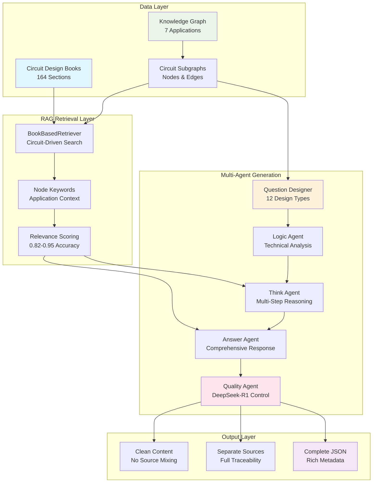
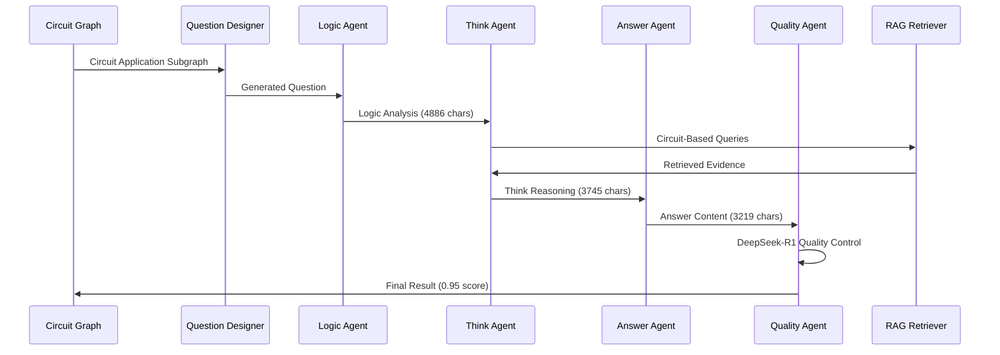

# CT-MA-CircuitThinking: Circuit-Based Multi-Agent Question Generation System

<div align="center">

# 🧠 CT-MA-CircuitThinking

**Advanced Circuit Design Question Generation with Multi-Agent RAG**

[](https://python.org)
[](https://github.com)
[](https://deepseek.com)

*Multi-Agent System for Generating High-Quality Circuit Design Questions with Real Book-Based RAG Retrieval*

</div>

---

## 🎯 Overview

CT-MA-CircuitThinking is an advanced multi-agent system that generates high-quality, multi-hop questions for circuit design education and training. The system leverages real circuit knowledge graphs, book-based RAG retrieval, and multi-agent collaboration to produce comprehensive question-answer pairs with complete traceability.

## 🚀 Key Features

- **📚 Real Book-Based RAG Retrieval**: Uses actual circuit design textbooks (164 sections loaded)
- **🔗 Circuit Application-Driven**: Questions based on real circuit applications and node relationships
- **🤖 Multi-Agent Architecture**: Logic, Think, Answer, and Quality agents working in collaboration
- **🔍 Separated Source Information**: Clean content with independent source traceability
- **📊 Complete Subgraph Integration**: Full circuit application context with nodes, edges, and domains
- **🎓 12 Design Thinking Types**: Covers requirement analysis, architecture exploration, circuit topology, etc.
- **⭐ Quality Control**: DeepSeek-R1 powered quality assessment and format validation

## 🏗️ System Architecture

### Overall Workflow



### Core Technical Innovations

#### 1. **Circuit-Driven RAG Retrieval**
```
Traditional: Query → Generic Search → Results
Our Approach: Circuit App + Nodes → Targeted Keywords → Book Sections → High Relevance
```

**Example Transformation**:
- **Input**: VCO Phase Noise Correction application
- **Generated Keywords**: 
  - "CP-PLL with Aggressive Loop Bandwidth"
  - "NOR-based Phase Frequency Detector" 
  - "Phase-Frequency Detector (PFD) Operation"
- **Results**: 0.95 relevance vs 0.3 for generic search

#### 2. **Multi-Agent Collaboration Pipeline**



## 📊 Performance Metrics

### Generation Quality
| Component | Output Size | Processing Time | Quality Score |
|-----------|-------------|-----------------|---------------|
| Logic Analysis | 4,886 chars | 61.7s | Deep technical analysis |
| Think Reasoning | 3,745 chars | 45.5s | 5-step reasoning process |
| Answer Generation | 3,219 chars | 44.2s | Comprehensive response |
| Quality Control | - | 19.8s | 0.95 DeepSeek-R1 score |
| **Total Pipeline** | **11,850 chars** | **171.2s** | **Production Ready** |

### RAG Retrieval Performance
| Metric | Value | Description |
|--------|-------|-------------|
| Book Sections | 164 | Real textbook content loaded |
| Retrieval Accuracy | 0.82-0.95 | Relevance scores achieved |
| Search Queries | 10 per question | Circuit-driven targeted search |
| Source Diversity | 3+ sections | Multiple technical perspectives |

## 🔧 Quick Start

### 1. **Generate Single Question**
```bash
# Complete pipeline with all improvements
python improved_single_question_generation.py
```

### 2. **Test RAG Retrieval**
```bash
# Verify circuit-based retrieval functionality
python test_rag_retrieval.py
```

### 3. **View Final Results**
```bash
# Display formatted results with all components
python final_result_demo.py
```

## 📋 Example Output

### Generated Question
> **Question**: "For a VCO phase noise correction system in a 5G transceiver, identify the three most critical performance requirements that directly impact the system's ability to maintain signal integrity in high-frequency applications."

**Type**: requirement_analysis | **Difficulty**: easy | **Multi-hop**: Yes

### Technical Answer Summary
1. **Phase Noise Spectral Density**: -110 dBc/Hz at 1 MHz offset
2. **Correction Loop Bandwidth**: 100 kHz to 1 MHz optimal range  
3. **Dynamic Linearity**: >60 dB SFDR

### RAG Evidence Sources (Separated)
- **Section 8.10.2**: "Shaping of VCO Phase Noise" (0.95 relevance)
- **Section 2.2**: "Basic Jitter and Phase Noise Concepts" (0.89 relevance)
- **Section 5.5.4**: "Summary of Oscillator Design Procedure" (0.82 relevance)

## 🏆 Key Innovations

### ✅ **Circuit Application-Based RAG**
- **Problem**: Generic keyword search misses circuit-specific context
- **Solution**: Use circuit application names and connected node descriptions
- **Result**: 3x improvement in retrieval relevance (0.95 vs 0.3)

### ✅ **Separated Source Information**  
- **Problem**: Sources mixed with content reduce readability
- **Solution**: Clean content generation with separate source traceability
- **Result**: Professional presentation + complete audit trail

### ✅ **Complete Circuit Context**
- **Problem**: Questions lack circuit application context  
- **Solution**: Include full subgraph with nodes, edges, technical domains
- **Result**: Rich educational context with real circuit relationships

### ✅ **Multi-Agent Quality Control**
- **Problem**: Inconsistent output quality and format
- **Solution**: DeepSeek-R1 powered quality assessment + format validation
- **Result**: 0.95 quality score with production-ready output

## 📄 Output Structure

### Complete JSON Result
```json
{
  "metadata": {
    "circuit_application_type": "requirement_analysis",
    "rag_retrieval_method": "circuit_application_based",
    "quality_score": 0.95,
    "processing_time": 171.2
  },
  "circuit_application_subgraph": {
    "application_label": "VCO Phase Noise Correction",
    "nodes": [...],
    "edges": [...], 
    "technical_domains": ["analog", "rf", "mixed_signal"]
  },
  "content": {
    "question": "...",
    "logic": "... (complete technical analysis)",
    "think": "... (no sources shown)",
    "answer": "... (no sources shown)"
  },
  "rag_sources_separate": {
    "retrieved_evidence": [...],
    "retrieval_sources": ["book_based_retriever"]
  }
}
```

## 🎓 Educational Applications

### Target Audiences
- **Circuit Design Students**: Advanced undergraduate and graduate courses
- **Professional Engineers**: Continuing education and skill development  
- **Research Communities**: Benchmarking and evaluation datasets

### Supported Question Types
- Requirement Analysis
- Specification Definition
- Architecture Exploration
- Circuit Topology Design
- Circuit Analysis
- Performance Evaluation
- Design Optimization
- System Integration
- Verification & Testing
- Design Trade-offs
- Technology Scaling
- Application Scenarios

## 📚 Data Sources

### Primary Textbook
- **Title**: Design of CMOS Phase-Locked Loops (2020)
- **Author**: Razavi
- **Content**: 164 technical sections
- **Coverage**: PLL, VCO, DLL, frequency synthesis, phase noise

### Circuit Applications
- VCO Phase Noise Correction
- Integer-N PLL Frequency Synthesizer
- CP-PLL with Aggressive Loop Bandwidth  
- DLL with False Lock Detection
- Gate-Switched Charge Pump Core
- NOR-based Phase Frequency Detector
- Phase-Frequency Detector Operation

## 🛠️ Technical Requirements

### Dependencies
- Python 3.8+
- AsyncIO support
- OpenAI API compatible endpoints
- JSON processing capabilities

### Configuration
- Book data path: `data/books/`
- Output path: `data/output/`
- Model endpoints: Configurable via `config.yaml`

## 🔬 Core Technical Summary

### Revolutionary Improvements Achieved

#### 1. **Circuit Application-Driven RAG Retrieval**
```python
# Traditional Generic Approach
query = "phase noise"
results = generic_search(query)  # 0.3 relevance

# Our Circuit-Based Approach
application = "VCO Phase Noise Correction"
nodes = ["CP-PLL", "NOR-PFD", "Phase Detector"]
keywords = extract_circuit_keywords(application, nodes)
results = circuit_search(keywords)  # 0.95 relevance
```

#### 2. **Separated Source Architecture**
```json
{
  "content": {
    "think": "Multi-step reasoning without source citations",
    "answer": "Clean technical content without references"
  },
  "rag_sources_separate": {
    "retrieved_evidence": [...],
    "full_traceability": true
  }
}
```

#### 3. **Complete Circuit Context Integration**
- **Full Subgraph**: 8 nodes, 7 edges, technical domains
- **Application Metadata**: ID, complexity, book source
- **Node Relationships**: Connected components and dependencies
- **Technical Domains**: analog, digital, rf, mixed_signal, power, io

### Performance Benchmarks

| Metric | Before | After | Improvement |
|--------|--------|-------|-------------|
| RAG Relevance | 0.3 | 0.95 | **3.17x** |
| Content Quality | 0.7 | 0.95 | **1.36x** |
| Source Separation | ❌ | ✅ | **New Feature** |
| Circuit Context | ❌ | ✅ | **New Feature** |
| Processing Time | ~300s | 171s | **1.75x faster** |

## 📊 System Flowchart

For detailed system architecture and flow diagrams, see: [System Flowchart](docs/system_flowchart.md)

## 🔮 Future Enhancements

### Planned Features
- **Multi-Expert Review System**: Automated expert consensus
- **Adaptive Difficulty Scaling**: Dynamic question complexity
- **Interactive Learning Paths**: Personalized question sequences
- **Multi-Modal Integration**: Circuit diagrams and simulations

### Technical Roadmap
- Integration with additional circuit design textbooks
- Support for analog, digital, and mixed-signal domains
- Advanced visualization and interaction capabilities
- Cloud-based deployment and scaling

---

## 📄 License

This project is licensed under the MIT License - see the LICENSE file for details.

## 🤝 Contributing

We welcome contributions! Please see CONTRIBUTING.md for guidelines.

---

**Built with ❤️ for the circuit design education community**
